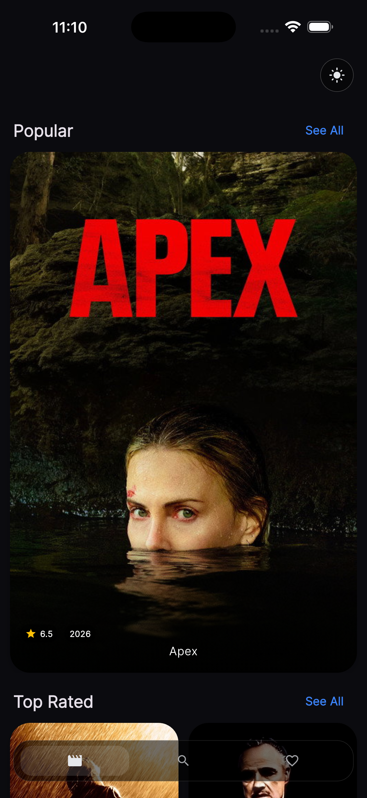
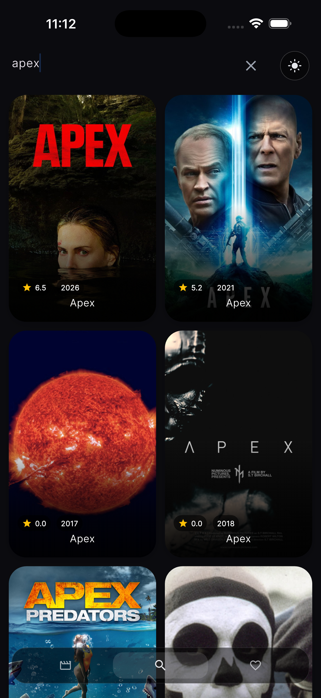
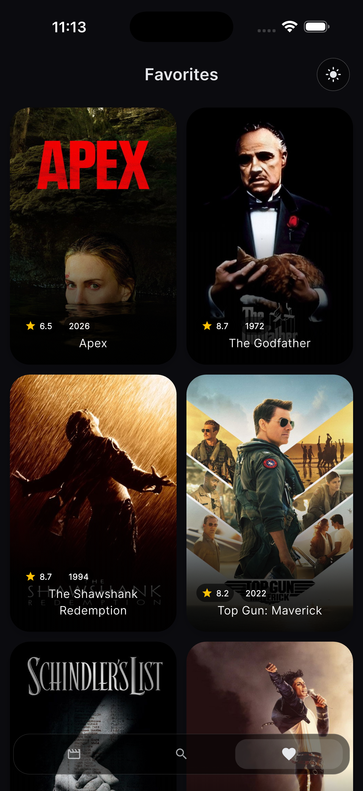
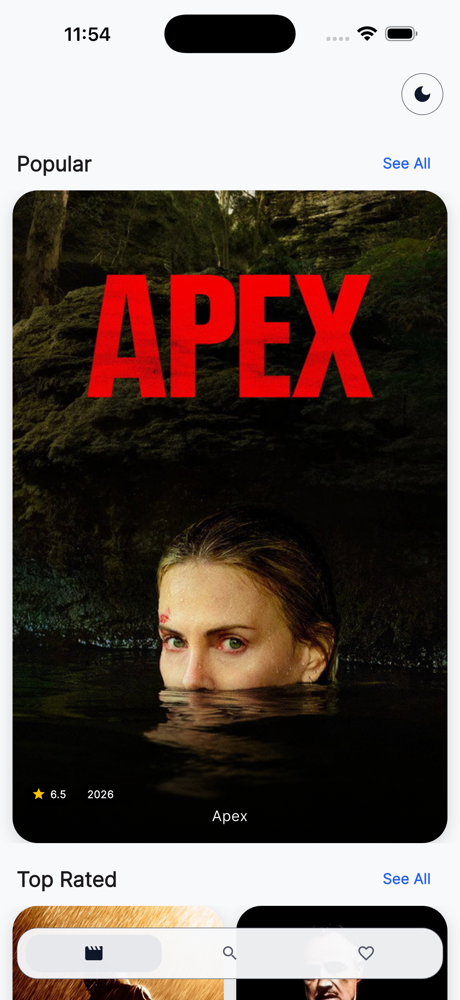
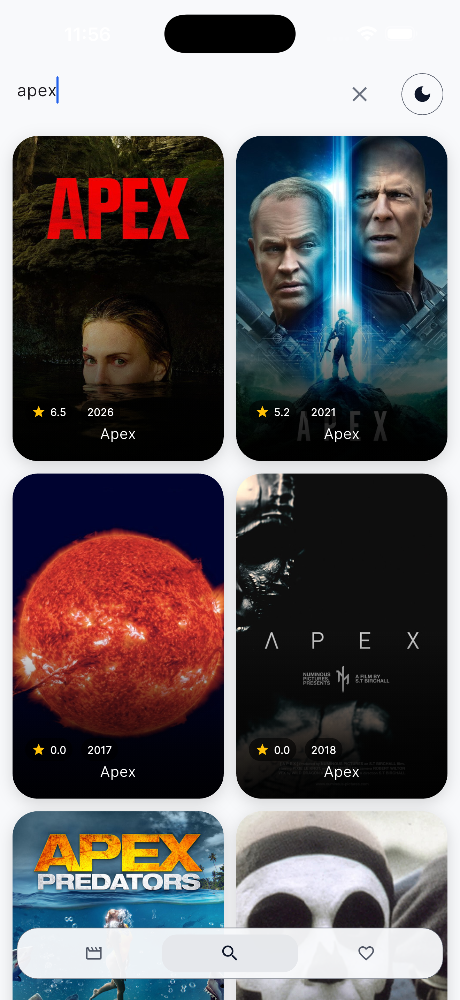
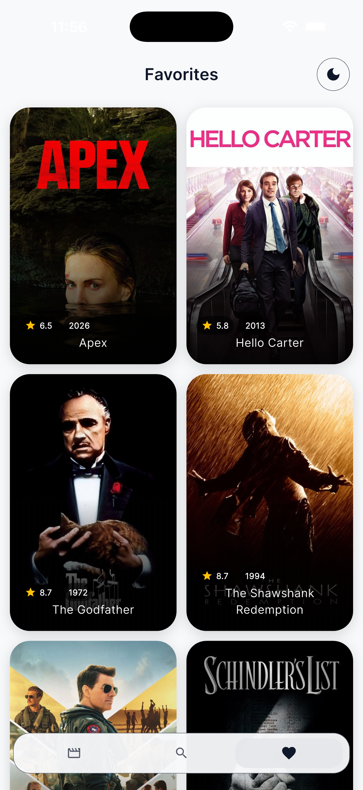
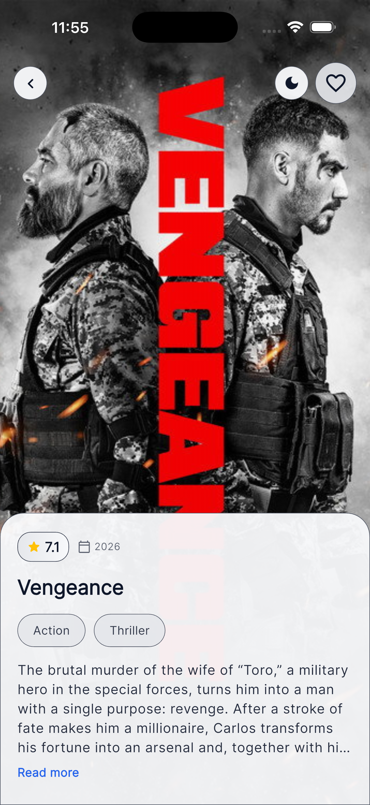

# Movie Browser App

A Flutter app for browsing movies from the TMDB API. Built with Clean Architecture and Bloc for state management.

## Features

- Browse popular, top-rated, and upcoming movies
- Search movies with debounced input
- View movie details
- Save and manage favorites locally
- Light and dark theme toggle
- Pagination for movie lists and grid views
- Shimmer loading placeholders

## Tech Stack

| Category | Technology |
|----------|------------|
| Framework | Flutter (Dart >=3.0.0) |
| State Management | flutter_bloc (Cubit) |
| HTTP Client | Dio |
| Local Storage | Hive |
| Image Caching | cached_network_image |
| Loading Effects | shimmer, lottie |
| Theming | google_fonts (Inter) |
| Environment | flutter_dotenv |
| Testing | bloc_test, mocktail |

## Architecture

The app follows Clean Architecture with three layers:

```
Presentation (cubit, screens, widgets)
       ^
       |  depends on
       |
   Domain (entities, repository interfaces)
       ^
       |  implements
       |
    Data (models, datasources, repository implementations)
```

**Domain** - Contains pure Dart entities (`Movie`) and abstract repository interfaces. No Flutter or external dependencies.

**Data** - Implements repository interfaces, handles API calls through `MovieRemoteDataSource`, and manages local storage via `MovieLocalDataSource` (Hive). `MovieModel` handles JSON parsing and Hive serialization.

**Presentation** - Cubits manage UI state. Screens observe cubit states and rebuild accordingly. Reusable widgets are extracted into the `widgets/` folder.

### Data Flow

1. UI triggers an action (e.g., user taps "load more")
2. Cubit calls the repository method
3. Repository delegates to the appropriate data source
4. Remote data source makes API call via `ApiClient` (Dio)
5. Response is parsed into `MovieModel`, converted to `Movie` entity, and returned
6. Cubit emits a new state with the data
7. UI rebuilds based on the new state

Favorites follow the same flow but use `MovieLocalDataSource` (Hive) instead of the remote source.

## State Management

The app uses Cubit (from flutter_bloc), which is a simplified version of Bloc that doesn't require events. Each screen or feature has its own cubit:

| Cubit | Responsibility |
|-------|---------------|
| `MovieListCubit` | Loads popular, top-rated, and upcoming movies for the home screen |
| `MovieGridCubit` | Handles pagination for category grid views |
| `SearchCubit` | Manages search queries with debouncing |
| `MovieDetailCubit` | Fetches movie details and handles favorite toggling |
| `FavoritesCubit` | Loads and manages the favorites list |
| `ThemeCubit` | Switches between light and dark themes |

Cubit was chosen over full Bloc because the app's interactions are straightforward -- most actions are simple function calls (load, search, toggle) that don't require complex event transformation. Cubit keeps the code lighter while still providing predictable state management.

Each cubit emits states with `isLoading`, `error`, and data fields. The UI listens to state changes via `BlocBuilder` and renders accordingly.

## Setup

### Prerequisites

- Flutter SDK (>=3.0.0)
- A TMDB API read access token

### Instructions

1. Clone the repository:

```bash
git clone <repo-url>
cd movie_browser
```

2. Install dependencies:

```bash
flutter pub get
```

3. Create a `.env` file in the project root:

```
TMDB_READ_ACCESS_TOKEN=your_tmdb_read_access_token_here
```

Get your token from [TMDB Settings > API](https://www.themoviedb.org/settings/api).

4. Run the app:

```bash
flutter run
```

### Generate Hive Adapters

If you modify `MovieModel` fields, regenerate the Hive adapter:

```bash
dart run build_runner build --delete-conflicting-outputs
```

## Folder Structure

```
lib/
├── main.dart                      # App entry point, dependency setup
├── core/
│   ├── constants/constants.dart   # API URLs, image sizes, app constants
│   ├── network/
│   │   ├── api_client.dart        # Dio wrapper with auth and timeouts
│   │   └── network_exceptions.dart # Custom exception hierarchy
│   ├── theme/app_theme.dart       # Light/dark Material 3 themes
│   └── utils/debouncer.dart       # Debounce utility for search
├── data/
│   ├── datasources/
│   │   ├── movie_remote_datasource.dart  # TMDB API calls
│   │   └── movie_local_datasource.dart   # Hive favorites storage
│   ├── models/movie_model.dart    # Data model with JSON and Hive serialization
│   └── repositories/
│       └── movie_repository_impl.dart    # Repository implementation
├── domain/
│   ├── entities/movie.dart        # Pure Movie entity
│   └── repositories/
│       └── movie_repository.dart  # Abstract repository interface
└── presentation/
    ├── cubit/                     # State management (6 cubits)
    ├── screens/                   # Full-screen widgets (5 screens)
    └── widgets/                   # Reusable UI components

test/
└── data/
    └── repositories/
        └── movie_repository_impl_test.dart
```

## Features

### Movie Lists
Three horizontal lists on the home screen -- popular, top-rated, and upcoming. Each loads the first page on startup and supports pagination when scrolled to the end.

### Movie Grid
Tapping "See All" on a category opens a grid view with infinite scroll pagination.

### Search
Debounced search input (500ms delay) to avoid excessive API calls. Results display in a grid layout.

### Movie Details
Displays poster, title, overview, rating, and release year. Favorite toggle available from this screen.

### Favorites
Movies saved to favorites are persisted in Hive. The favorites screen shows saved movies with swipe-to-delete and undo support.

### Theme
Dark theme by default. Toggle button in the app bar switches between light and dark with an animated rotation.

## Screenshots

### Dark Mode

| Home | Search | Favorites |
|------|--------|-----------|
|  |  |  |

| Movie Detail | Grid View |
|-------------|-----------|
|  |  |

### Light Mode

| Home | Search | Favorites |
|------|--------|-----------|
|  |  |  |

| Movie Detail | Grid View |
|-------------|-----------|
|  |  |

## Running Tests

```bash
flutter test
```

Current coverage includes the repository layer (18 test cases).